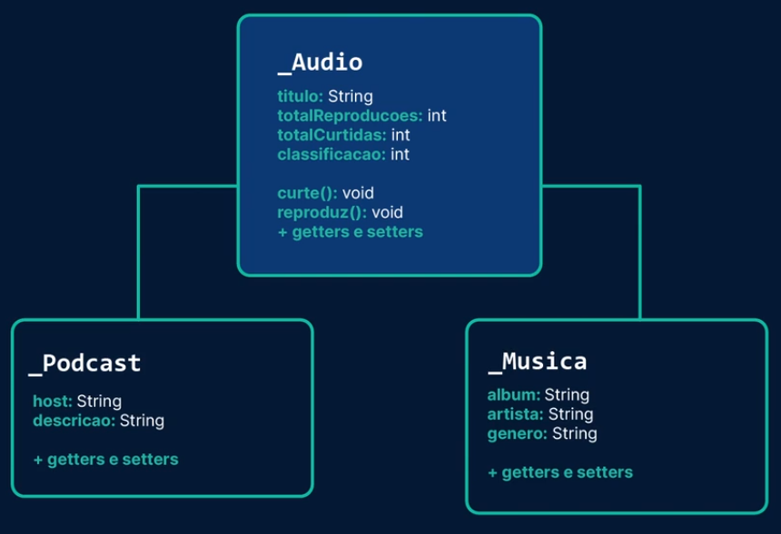

# musicplus
Desafio proposto na última aula do segundo curso da Formação Java da Alura

## Desafio
Implementar uma aplicação para cadastrar músicas e podcasts preferidos, modelando as classes utilizando os conceitos de orientação a objetos: abstração, herança, encapsulamento e polimorfismo. 

## Modelagem

